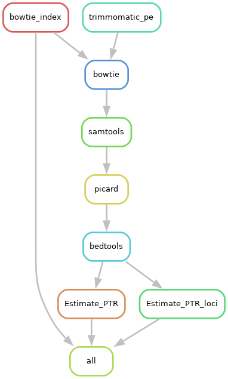

# Growth-rate-estimate_SMAKE

##### Growth-rate-analysis is a snakemake to calculate peak to through ratio (PTR - ratio of copy numbers at origin of replication to terminus) from  mapped reads coverage.

The pipeline follows the coverage smoothing algorithm as described in the publication: 

[Growth dynamics of gut microbiota in health and disease inferred from single metagenomic samples](http://science.sciencemag.org/content/349/6252/1101.long)

